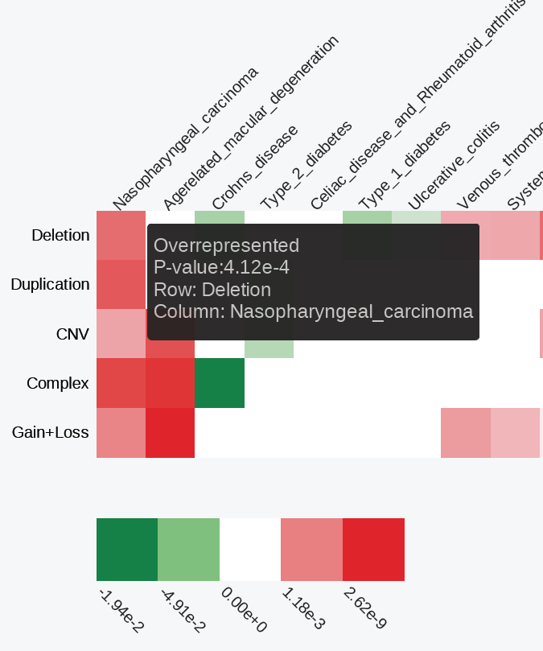

```{r knitsetup, echo=FALSE, results='hide', warning=FALSE, message=FALSE, cache=FALSE}

opts_knit$set(base.dir='./', fig.path='figures/', out.format='md')
opts_chunk$set(cache.path='cache/', fig.path='figures/', cache=FALSE, tidy=TRUE, fig.keep='high', echo=TRUE, dpi=300, out.width=700, prompt=FALSE, comment='##', results='markup', eval=FALSE)
# See yihui.name/knitr/options for more Knitr options.
```

Enrichment analysis results
========================================================

The results of the enrichment analysis are stored in a tab-separated `matrix.txt` text file. This is an *NxM* matrix, where *N* (rows) is the number of regulatory datasets, and *M* (columns) is the number of SNP sets. If one set of SNPs was analyzed, the matrix will contain 1 column.

Each cell of the matrix represents an enrichment p-value obtained from a set of SNPs vs. a regulatory dataset enrichment analysis. We employ hypergeometric distribution (Chi square test) to calculate the enrichment p-values and correct them for multiple testing using FDR. If an *underrepresented* enrichment is detected, the p-value is pre-fixed with a "-" sign. Before visualization, the matrix is filtered to remove rows (regulatory datasets) showing no statistically significant enrichments (at least a single condition with p-value < 0.01). The filtered matrix is then [-log10-transformed](../misc/Faq.md), clustered using “Euclidean” distance to measure dissimilarity between rows and columns, and the “ward” agglomeration method, saved into the `clustered.txt` file and visualized as an interactive heatmap.



Red/green gradient highlights the level of significant enrichment/depletion, respectively. The `matrix.txt` and `clustered.txt` text files are available for download through the web interface and as a part of the [command line](hypergeom4.md) module output. 

The SNP set-specific detailed enrichment results are outputted into the separate text files in the `enrichment` subfolder. The files are named after the names of SNP set-specific files, e.g., if a "SLE.bed" file was analyzed, its detailed enrichment results will be outputted into "enrichment/SLE.txt" file.