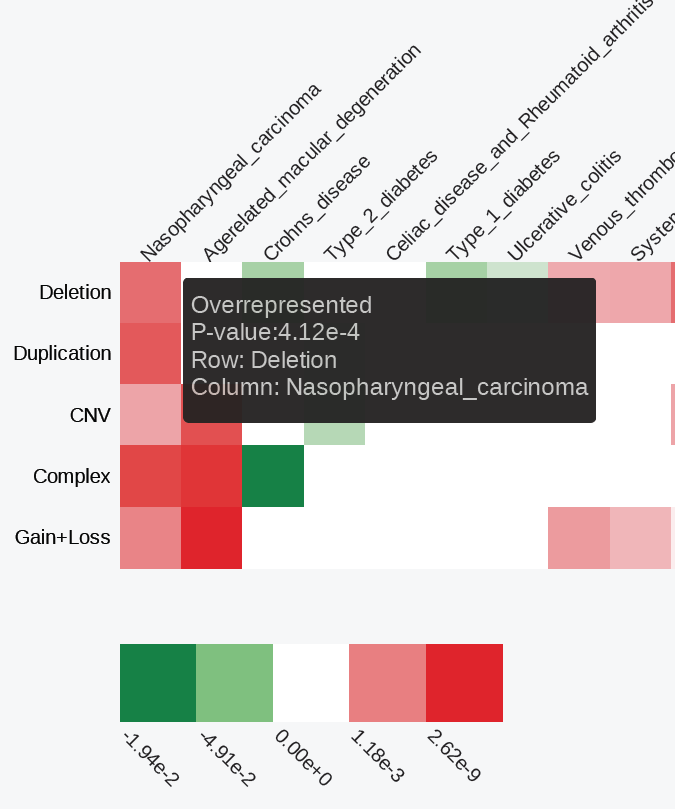

Enrichment analysis results
========================================================

The results of enrichment analysis are stored in tab-separated `matrix.txt` text file. This is an *NxM* matrix, where *N* (rows) is the number of genomic features, and *M* (columns) is the number of features of interest. If one set of SNPs was analyzed, the matrix will contain 1 column.

Each cell of the matrix represent a multiple testing corrected p-value (if selected) for a set of SNPs vs. a genomic feature enrichment analysis (see [Enrichment analysis statistics](../statistics/enrichment.md) for details). If an *underrepresented* enrichment is detected, the p-value is pre-fixed with a "-" sign. Before visualization, the matrix is filtered to remove rows (genome annotation features) showing no statistically significant enrichments (at least a single condition with p-value < 0.01). The filtered matrix is then [-log10-transformed](../misc/Faq.md), clustered using “Euclidean” distance to measure dissimilarity between rows and columns, and the “complete” agglomeration method, saved into `clustered.txt` file and visualized as an interactive heatmap.

The `matrix.txt` and `clustered.txt` text files are available for download through the web interface and as a part of [command line module](hypergeom4.md) output. 

The SNP set-specific detailed enrichment results are outputted into separate text files in the `enrichment` subfolder. The files are named after the names of SNP set-specific files, e.g., if an "SLE.bed" file was analyzed, its detailed enrichment results will be outputted into "enrichment/SLE.txt" file.
