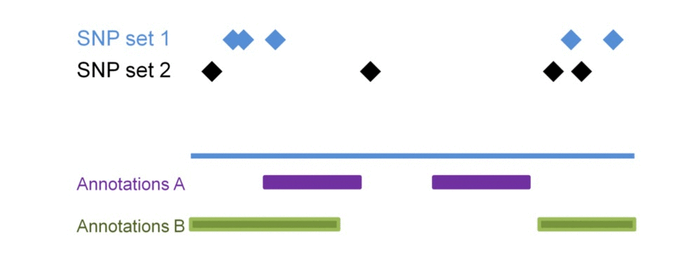
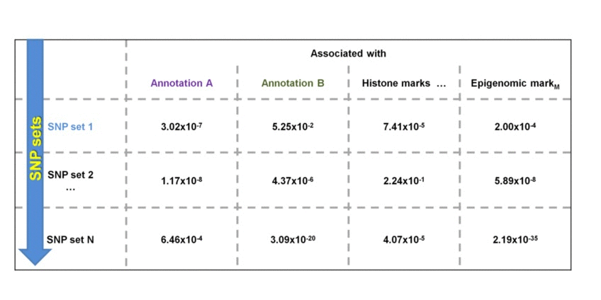
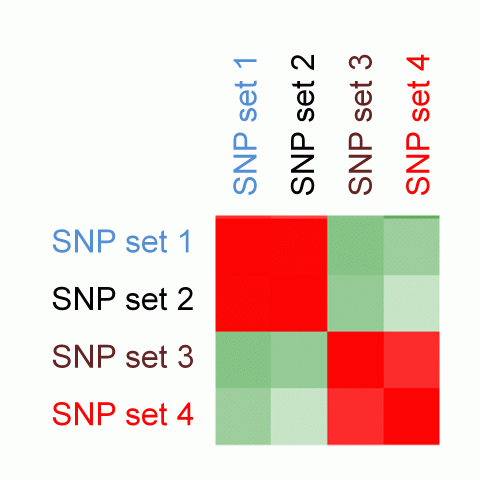
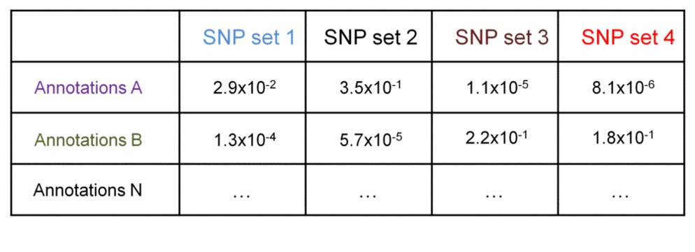

Regulatory similarity analysis results
========================================================

The [ergulatory similarity analysis](../misc/definitions.md) estimates similarity among the sets of SNPs based on their enrichment within regulatory landscapes. Consider 3 sets of SNPs:

SNP sets 1 & 2 are enriched in regulatory dataset B but not in A. SNP seta 3 & 4 are similarly enriched  in regulatory dataset A but not in B. Testing each SNP set against additional regulatory datasets will construct the SNP set-specific [regulatory enrichment profile](../misc/definitions.md) of the [transformed enrichment p-values](../misc/definitions.md). 

We perform pair-wise comparison of the SNP set-specific regulatory enrichment profiles, construct an MxM matrix of Pearson's correlation coefficients (PCCs) and visualize it as a heatmap. For our example, the epigenomic similarity heatmap may look like:

Red/green gradient highlights the level of strong/weak regulatory similarity, respectively, among the SNP sets. Naturally, a regulatory profile of a set of SNPs compared with itself will show perfect similarity - therefore, the PCCs on the diagonal of the regulatory similarity heatmap are equal to 1 (and are bright red in color).

We can further identify if the significance of enrichment is statistically different between groups of SNP set 1 & 2 vs. SNP set 3 & 4. This may be useful when comparing enrichment profiles of groups of SNP sets from different individuals. This comparison may answer questions like "Which regulatory datasets are associated with patient-specific SNPs and not with the SNPs in healthy population?", or "Are there groups of patients with SNPs differentially associated with certain regulatory datasets, which ones?".

Consider a matrix of the -log10-transformed enrichment p-values - they can be compared between the groups using t-test. Assuming standard deviation of the transformed p-values within the groups is 0.8, we need 6x6 groups to detect 2-fold difference at 0.05 significance level at 90% power. This 2-fold difference may indicate SNPs in one group have no associations with a regulatory datasets (transformed p-values are 0, or non-transformed are 1), while SNPs in another group have statistically significant associations (transformed p-values are 2, or non-transformed are 0.01).

Examples of such regulatory differential analyses can be found in [https://github.com/mdozmorov/gwas2bed](https://github.com/mdozmorov/gwas2bed)
