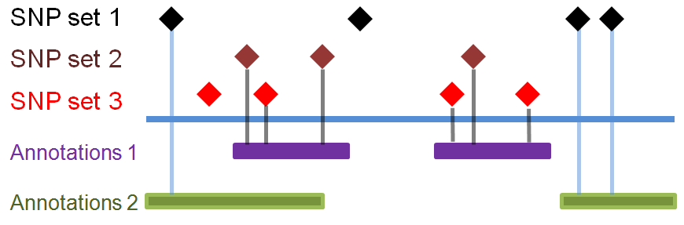
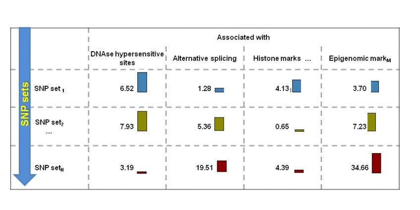
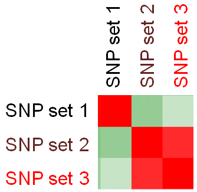

Epigenomic similarity analysis results
========================================================

The [epigenomic similarity analysis](../misc/definitions.md) estimates similarity among the sets of SNPs based on their enrichment within regulatory landscapes. Consider 3 sets of SNPs:

SNP set 1 is enriched in Genomic annotations 2 but not in 1. SNP set 2 and SNP set 3 are similarly enriched  in Genomic annotations 1 but not in 2. Testing each SNP set against additional genomic annotations will construct the SNP set-specific [epigenomic enrichment profile](../misc/definitions.md) of the [transformed enrichment p-values](../misc/definitions.md). 

We perform pair-wise comparison of SNP set-specific epigenomic enrichment profiles, construct an MxM matrix of Pearson's correlation coefficients (PCCs) and visualize it as a heatmap. For our example, the epigenomic similarity heatmap may look like:

Red/green gradient highlights the level of strong/weak epigenomic similarity, respectively, among SNP sets. Naturally, an epigenomic profile of a set of SNPs compared with itself will show perfect similarity - therefore, the PCCs on the diagonal of the epigenomic similarity heatmap are equal to 1 (and are the bright red in color).

