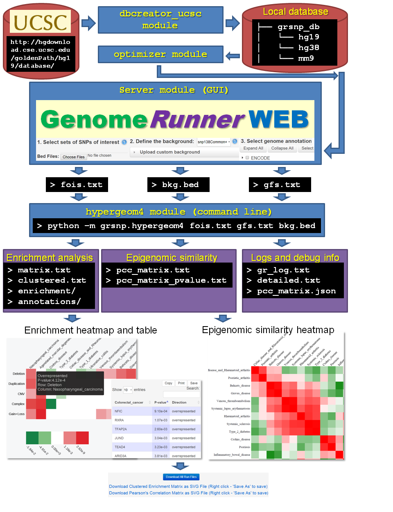

```{r knitsetup, echo=FALSE, results='hide', warning=FALSE, message=FALSE, cache=FALSE}

opts_knit$set(base.dir='./', fig.path='figures/', out.format='md')
opts_chunk$set(cache.path='cache/', fig.path='figures/', cache=FALSE, tidy=TRUE, fig.keep='high', echo=TRUE, dpi=300, out.width=700, prompt=FALSE, comment='##', results='markup', eval=FALSE)
# See yihui.name/knitr/options for more Knitr options.
```

Modules
========================================================

GenomeRunner is installed as a `grsnp` package. There are four modules in the package:

1. `dbcreator_ucsc` and `dbcreator_encodeDCC` # modules for creating organism-specific genome annotation databases
2. `optimizer` # a module to pre-calculate background overlaps with all genomic features
3. `server` # a module for the web interface
4. `hypergeom4` # a command-line executable for the enrichment/epigenomic similarity analyses

The interplay among the modules is shown on the figure 



Before running GenomeRunner, the first step is to create a database of genomic annotations using the  [dbcreator](../dbcreator/dbcreator.md) module. Optionally, optimize the database using the [optimizer](../optimizer/optimizer.md) module. Then, run GenomeRunner web server using the [server](../server/server.md) module. To run GenomeRunner from command line, use the [`hypergeom4`](../hypergeom4/hypergeom4.md) module.