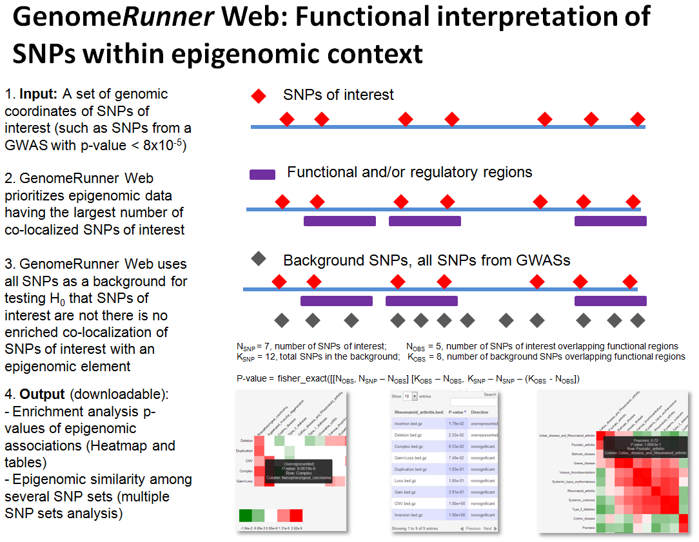

```{r knitsetup, echo=FALSE, results='hide', warning=FALSE, message=FALSE, cache=FALSE}

opts_knit$set(base.dir='./', fig.path='figures/', out.format='md')
opts_chunk$set(cache.path='cache/', fig.path='figures/', cache=FALSE, tidy=TRUE, fig.keep='high', echo=TRUE, dpi=300, out.width=700, prompt=FALSE, comment='##', results='markup', eval=FALSE)
# See yihui.name/knitr/options for more Knitr options.
```

FAQ
========================================================

### * How GenomeRunner can help me?

GenomeRunner helps to interpret potential regulatory effect of SNPs ([features of interest, FOIs](definitions.md)) by identifying functional elements ([aka (epi)genomic features, GFs](definitions.md)) most statistically significantly co-localized with them (see [Enrichment analysis](definitions.md)).

If one analyzes three or more sets of SNPs, such as SNPs from different individuals, populations, diseases, GenomeRunner visualizes their epigenomic similarity (see [Epigenomic Similarity analysis](../hypergeom4/episimilarity.md)). This information may be used, e.g., to group patients by similarity of their individual sets of genomic variants within sell type-specific regulatory landscapes.



### * How should my input data look like (Step 1)?

Use tab-separated text files with genomic coordinates of the SNPs of interest in [BED format](http://genome.ucsc.edu/FAQ/FAQformat.html#format1), see [examples](http://uswest.ensembl.org/info/website/upload/bed.html). As a bare minimun, chromosome, start, and end coordinates should be provided. One can upload BED file(s), or copy-paste tab-separated coordinates.

**Note**: a set of SNPs should contain at least 5 SNPs to be eligible for the analysis. Genomic coordinates should be 0-bases. The end coordinate should equal start coordinate + 1.

**Note**: lists of new line-separated rsIDs (e.g., rs2789489\nrs4360154\nrs630642) can be submitted, provided a cross-mapping file has been created (see [Custom data](../dbcreator/dbcreatorCustom.md)). This feature, however, should be considered experimental, use genomic coordinates where possible. Caveat emptor.

### * Do you have some sets of SNPs for demo runs?

Sure. Several buttons on the front page will select pre-defined sets of SNPs for the analysis.  For *Homo Sapiens* these include (To be updated):

| Pre-defined sets of SNPs                                                                                  | When to use                                                                                                                                  |
|-----------------------------------------------------------------------------------------------------------|----------------------------------------------------------------------------------------------------------------------------------------------|
| `GWAS_vs_DGV` - selected disease-associated SNP sets from GWAScatalog.                                      | Used with *gwasCatalog* background, to be run for enrichment vs. structural variants (dgvVariants)                                                            |
| `GWAS_vs_tfbsEncode` - selected disease-associated SNP sets from GWAScatalog.                               | Used with *gwasCatalog* background, to be run for enrichment vs. 161 experimentally obtained transcription factor binding sites (tfbsEncode)                  |
| `snp138Rand` - randomly selected sets of SNPs from the snp138 database.                                     | Used with *snp138* background and any (category of) genome annotation elements, to ensure random SNPs do not show significant associations     |
| `gwasRand` - randomly selected sets of SNPs from  GWAScatalog.                                              | Used with `gwascatalog` background and any (category of) genome annotation elements, to ensure random SNPs do not show significant associations |
| `GWASmore15` - all disease- or trait-associated SNP sets from GWAScatalog having more than 15 SNPs in a set | Used with `gwascatalog` background for explorartory analyses vs. any (category of) genome annotation elements                                                              |

### * What is the "background" (Step 2)?

See the [Background](../dbcreator/dbcreatorBackground.md) section. In short, the background is a “universe” of all SNPs assessed in a study, from which the SNPs of interest came from. Several pre-defined background sets are provided, for *Homo Sapiens* these include:

| Pre-defined background                                                                | When to use                                                                                                                                         |
|---------------------------------------------------------------------------------------|-----------------------------------------------------------------------------------------------------------------------------------------------------|
| snp138 (All Simple Nucleotide Polymorphisms (dbSNP 138))                             | For sets of SNPs from whole-genome GWA studies                                                                                                              |
| snp138Common (Simple Nucleotide Polymorphisms (dbSNP 138) Found in >= 1% of Samples) | For sets of SNPs from studies where rare variants were ignored                                                                                              |
| gwascatalog (NHGRI Catalog of Published Genome-Wide Association Studies)             | For demo testing, to observe regulatory associations of disease-specific sets of SNPs, as compared with randomly selected SNPs from all GWAScatalog |

  For a GWAS, the background is likely to be all SNPs (snp138 for *Homo Sapiens*). For a study using microarrays, the background should contain coordinates of all SNPs on the microarray - upload or copy/paste them.

**Note**: The SNPs of interest should be a subset of the background SNPs. If some SNPs of interest do not overlap the background, a non-critical error is issued. Use [BEDtools](https://github.com/arq5x/bedtools2) for creating custom backgrounds and for any other manipulations with the BED files.

### * What are "genome annotation features" (Step 3)?

[Genome annotations](definitions.md) are discrete regions potentially having functional/regulatory properties. Vast majority of them were experimentally obtained by the [ENCODE project](http://www.genome.gov/encode/).

### * There are just too many genome annotation features!!! What to choose?

Don't panic. The genome annotation features are organized by categories mirrored from the UCSC genome browser (see [Database structure](../dbcreator/dbcreatorStructure.md)). Use search box and/or checkboxes in the TreeView control to select one or more genome annotation categories. Clicking on a genome annotation’ name will bring up description, if available.
 
The ENCODE data are organized by source/data type, tiers (quality), and by cell types. *Hint*: Several well-known/specially processes genome annotation features sets are brought forward as “default genome annotation features”. For *Homo Sapiens* these include:

| Genome annotation category                                                                                            | Experimental question: Are the SNPs of interest...                                              |
|-----------------------------------------------------------------------------------------------------------------------|-------------------------------------------------------------------------------------------------|
| [altSplicing](https://genome.ucsc.edu/cgi-bin/hgTrackUi?hgsid=381293375_xxuzKzx80QrJD5K5yoLpCkSoHtwk&g=knownAlt&hgTracksConfigPage=configure) (Alternative Splicing, Alternative Promoter and Similar Events in UCSC Genes, split by splicing type)     | ... potentially disrupt a specific type of alternative spliced regions?                         |
| [chromStates](https://genome.ucsc.edu/cgi-bin/hgTrackUi?hgsid=381293375_xxuzKzx80QrJD5K5yoLpCkSoHtwk&g=wgEncodeBroadHmm&hgTracksConfigPage=configure) (Chromatin State Segmentation by HMM from ENCODE/Broad, Gm12878 cell line, split by chromatin state type) | ... preferentially located in certain chromatin states?                                         |
| [coriellVariants](https://genome.ucsc.edu/cgi-bin/hgTrackUi?hgsid=381293375_xxuzKzx80QrJD5K5yoLpCkSoHtwk&g=coriellDelDup&hgTracksConfigPage=configure) (Coriell Cell Line Copy Number Variants, split by cell types)                                         | ... enriched in CNVs, and in which cell type?                                                   |
| [gapLocations](https://genome.ucsc.edu/cgi-bin/hgTrackUi?hgsid=381293375_xxuzKzx80QrJD5K5yoLpCkSoHtwk&g=gap&hgTracksConfigPage=configure) (Gap locations)                                                                                            | ... happen to be in gaps, telomeres, heterochromatin regions?                                   |
| [genomicVariants](https://genome.ucsc.edu/cgi-bin/hgTrackUi?hgsid=381293375_xxuzKzx80QrJD5K5yoLpCkSoHtwk&g=dgvPlus&hgTracksConfigPage=configure) (Database of Genomic Variants: Structural Variation (CNV, Inversion, In/del), split by variant type)  | ... enriched in CNVs, or other types of structural variations?                                  |
| [H3K4me3](http://www.ncbi.nlm.nih.gov/pubmed/23263488) (Tissue-specific histone 3 lysine 4 trimethylation marks)                                                     | ... enriched in tissue-specific active transcription-associated histone mark?                   |
| [histoneMarks](https://genome.ucsc.edu/cgi-bin/hgTrackUi?hgsid=381293375_xxuzKzx80QrJD5K5yoLpCkSoHtwk&g=wgEncodeBroadHistone&hgTracksConfigPage=configure) (Histone modifications by ChIP-seq from ENCODE/Broad institute, Gm12878 cell line                        | ... enriched in B-lymphoblastoma-associated histone modification marks?                         |
| [ncRNAs](https://genome.ucsc.edu/cgi-bin/hgTrackUi?hgsid=381293375_xxuzKzx80QrJD5K5yoLpCkSoHtwk&g=wgRna&hgTracksConfigPage=configure) (C/D and H/ACA Box snoRNAs, scaRNAs, and microRNAs from snoRNABase and miRBase, split by ncRNA type)           | ... associated with a class of non-coding elements?                                             |
| [repeats](https://genome.ucsc.edu/cgi-bin/hgTrackUi?hgsid=381293375_xxuzKzx80QrJD5K5yoLpCkSoHtwk&g=rmsk&hgTracksConfigPage=configure) (Repeating Elements by RepeatMasker, split by repeat class)                                                   | ... enriched in regions of low complexity, and in which type?                                   |
| [tfbsConserved](https://genome.ucsc.edu/cgi-bin/hgTrackUi?hgsid=381293375_xxuzKzx80QrJD5K5yoLpCkSoHtwk&g=tfbsConsSites&hgTracksConfigPage=configure) (HMR Conserved Transcription Factor Binding Sites, split by TFBS name)                                  | ... potentially disrupt a specific computationally predicted transcription factor binding site? |
| [tfbsEncode](https://genome.ucsc.edu/cgi-bin/hgTrackUi?hgsid=381293375_xxuzKzx80QrJD5K5yoLpCkSoHtwk&g=wgEncodeRegTfbsClusteredV2&hgTracksConfigPage=configure) (Transcription Factor ChIP-seq Clusters V3 (161 targets, 189 antibodies) from ENCODE, split by TFBS name)  | ... potentially disrupt a specific experimentally defined transcription factor binding site?    |
<!--| [gwasCatalog](https://genome.ucsc.edu/cgi-bin/hgTrackUi?hgsid=381293375_xxuzKzx80QrJD5K5yoLpCkSoHtwk&g=gwasCatalog&hgTracksConfigPage=configure) (NHGRI Catalog of Published Genome-Wide Association Studies, split by disease/trait types)                | ... enriched in known disease-specific SNPs?                                                    |-->

Examples of what to choose:

- Select the `tfbsEncode` category to get an answer whether the SNPs of interest are enriched in any of the 161 transcription factor binding sites identified by ChIP-seq.
- Select the `histoneMarks` category to get an insight whether the SNPs of interest are enriched in histone marks in B lymphocytes.
- Select the `genes` category to answer a question whether the SNPs of interest are enriched in genes/exons.

### * How GenomeRunner web server is different from previously published version?

The original version of GenomeRunner, hosted on [SourceForge](http://sourceforge.net/projects/genomerunner/), was designed as an "all purpose" tool. It has several advantages over the web interface, as well as disadvantages, such as learning curve, various non-obvious settings, need to download large databases, restriction to Windows platform, lacking visualization capabilities. GenomeRunner web server addresses these issues - it is:

  - Platform-independent, runs in a browser (Google Chrome recommended)
  - Simple and intuitive interface
  - Visual, the results are presented as interactive heatmaps
  - Implements a novel idea of [epigenomic similarity analysis](../hypergeom4/episimilarity.md), to understand relationships among sets of SNPs on regulatory level
  - Downloads-free, we host and maintain genome annotation databases
  - Supports local installation and command line usage

### * How to cite GenomeRunner?

If you find GenomeRunner useful, please, [cite the 2012 paper](../references.md). The manuscript describing the web version is in preparation

### * I still have questions/suggestions/bug report. What to do?

Please, contact 
