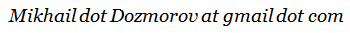

FAQ
========================================================

### * How GenomeRunner can help me?

GenomeRunner helps to interpret potential regulatory effect of SNPs ([features of interest, FOIs](definitions.md)) by identifying functional elements ([aka (epi)genomic features, GFs](definitions.md)) most statistically significantly co-localized with them (see [Enrichment analysis](definitions.md)).

If one analyzes three or more sets of SNPs, such as SNPs from different individuals, populations, diseases, GenomeRunner visualizes their regulatory similarity (see [Regulatory Similarity analysis](../hypergeom4/episimilarity.md)). This information may be used, e.g., to group patients by similarity of their individual sets of genomic variants within sell type-specific regulatory landscapes.

### * How should my input data look like (Step 1)?

Use tab-separated text files with genomic coordinates of the SNPs of interest in [BED format](http://genome.ucsc.edu/FAQ/FAQformat.html#format1), see [examples](http://uswest.ensembl.org/info/website/upload/bed.html). As a bare minimun, chromosome, start, and end coordinates should be provided. One can upload BED file(s), or copy-paste tab-separated coordinates.

**Note**: a set of SNPs should contain at least 5 SNPs to be eligible for the analysis. Genomic coordinates should be 0-bases. The end coordinate should equal start coordinate + 1.

**Note**: lists of rsIDs (e.g., rs2789489, rs4360154, rs630642), each rsID is on a separate line, can be submitted.

### * Do you have some sets of SNPs for demo runs?

Sure. Several buttons on the front page will select pre-defined sets of SNPs for the analysis.  For *Homo Sapiens* these include (To be updated):

| Pre-defined sets of SNPs | What is it                                                                                                                          | When to use                                                                                                                                                                                             |
|--------------------------|-------------------------------------------------------------------------------------------------------------------------------------|---------------------------------------------------------------------------------------------------------------------------------------------------------------------------------------------------------|
| gwasCatalog              | Sets of disease- and trait-associated SNPs from [gwasCatalog](http://www.genome.gov/gwastudies/). Each SNP set has 15 or more SNPs. | To investigate enrichments and regulatory similarity among all disease- and trait-associated SNP sets. Use with *gwasCatalog* background.                                                               |
| gwasCatalog_vs_DGV       | Selected set of disease- and trait-associated SNPs from [gwasCatalog](http://www.genome.gov/gwastudies/).                           | Use for demo purposes, to be run against structural variants from [DGV](http://dgv.tcag.ca/dgv/app/home). Use with *gwasCatalog* background.                                                            |
| gwasCatalog_vs_H3K4me3   | Selected set of disease- and trait-associated SNPs from [gwasCatalog](http://www.genome.gov/gwastudies/).                           | Use for demo purposes, to be run against tissue-specific H3K4me3 histone methylation mark from [Trynka-Raychaudhuri paper](http://www.ncbi.nlm.nih.gov/pubmed/23263488). Use with *gwasCatalog* background. |

### * What is the "background" (Step 2)?

See the [Background](../dbcreator/dbcreatorBackground.md) section. In short, the background is a “universe” of all SNPs assessed in a study, from which the SNPs of interest came from. Several pre-defined background sets are provided, for *Homo Sapiens* these include:

| Pre-defined background                                                                | When to use                                                                                                                                         |
|---------------------------------------------------------------------------------------|-----------------------------------------------------------------------------------------------------------------------------------------------------|
| snp141 (All Simple Nucleotide Polymorphisms (dbSNP 141))                             | For sets of SNPs from whole-genome GWA studies                                                                                                              |
| snp141Common (Simple Nucleotide Polymorphisms (dbSNP 138) Found in >= 1% of Samples) | For sets of SNPs from studies where rare variants were ignored                                                                                              |
| gwascatalog (NHGRI Catalog of Published Genome-Wide Association Studies)             | For demo testing, to observe regulatory associations of disease-specific sets of SNPs, as compared with randomly selected SNPs from all GWAScatalog |

  For a GWAS, the background is likely to be all SNPs (snp141 for *Homo Sapiens*). For a study using microarrays, the background should contain coordinates of all SNPs on the microarray - upload or copy/paste them.

**Note**: The SNPs of interest should be a subset of the background SNPs. If some SNPs of interest do not overlap the background, a non-critical error is issued. Use [BEDtools](https://github.com/arq5x/bedtools2) for creating custom backgrounds and for any other manipulations with the BED files.

### * What are "regulatory datasets" (Step 3)?

[Regulatory datasets](definitions.md) are sets of discrete regions potentially having functional/regulatory properties. Vast majority of these data were experimentally obtained by the [ENCODE project](http://www.genome.gov/encode/).

### * There are just too many regulatory datasets!!! What to choose?

Don't panic. The genome annotation features are organized by categories mirrored from the UCSC genome browser (see [Database structure](../dbcreator/dbcreatorStructure.md)). Use search box and/or checkboxes in the TreeView control to select one or more categories of regulatory datasets. Clicking on a regulatory dataset’ name will bring up description, if available.
 
The ENCODE data are organized by source/data type, tiers (quality), and by cell types. *Hint*: Several well-known/specially processes genome annotation features sets are brought forward as “default genome annotation features”. For *Homo Sapiens* these include:

| Genome annotation category                                                                                            | Experimental question: Are the SNPs of interest...                                              |
|-----------------------------------------------------------------------------------------------------------------------|-------------------------------------------------------------------------------------------------|
| [altSplicing](https://genome.ucsc.edu/cgi-bin/hgTrackUi?hgsid=381293375_xxuzKzx80QrJD5K5yoLpCkSoHtwk&g=knownAlt&hgTracksConfigPage=configure) (Alternative Splicing, Alternative Promoter and Similar Events in UCSC Genes, split by splicing type)     | ... potentially disrupt a specific type of alternative spliced regions?                         |
| [chromStates](https://genome.ucsc.edu/cgi-bin/hgTrackUi?hgsid=381293375_xxuzKzx80QrJD5K5yoLpCkSoHtwk&g=wgEncodeBroadHmm&hgTracksConfigPage=configure) (Chromatin State Segmentation by HMM from ENCODE/Broad, Gm12878 cell line, split by chromatin state type) | ... preferentially located in certain chromatin states?                                         |
| [coriellVariants](https://genome.ucsc.edu/cgi-bin/hgTrackUi?hgsid=381293375_xxuzKzx80QrJD5K5yoLpCkSoHtwk&g=coriellDelDup&hgTracksConfigPage=configure) (Coriell Cell Line Copy Number Variants, split by cell types)                                         | ... enriched in CNVs, and in which cell type?                                                   |
| [DGV](https://genome.ucsc.edu/cgi-bin/hgTrackUi?hgsid=381293375_xxuzKzx80QrJD5K5yoLpCkSoHtwk&g=gap&hgTracksConfigPage=configure) (Gap locations)                                                                                            | ... happen to be in gaps, telomeres, heterochromatin regions?                                   |
| [genomicVariants](https://genome.ucsc.edu/cgi-bin/hgTrackUi?hgsid=381293375_xxuzKzx80QrJD5K5yoLpCkSoHtwk&g=dgvPlus&hgTracksConfigPage=configure) (Database of Genomic Variants: Structural Variation (CNV, Inversion, In/del), split by variant type)  | ... enriched in CNVs, or other types of structural variations?                                  |
| [H3K4me3](http://www.ncbi.nlm.nih.gov/pubmed/23263488) (Tissue-specific histone 3 lysine 4 trimethylation marks)                                                     | ... enriched in tissue-specific active transcription-associated histone mark?                   |
| [ncRNAs](https://genome.ucsc.edu/cgi-bin/hgTrackUi?hgsid=381293375_xxuzKzx80QrJD5K5yoLpCkSoHtwk&g=wgRna&hgTracksConfigPage=configure) (C/D and H/ACA Box snoRNAs, scaRNAs, and microRNAs from snoRNABase and miRBase, split by ncRNA type)           | ... associated with a class of non-coding elements?                                             |
| [nestedRepeats](http://genome.ucsc.edu/cgi-bin/hgTrackUi?hgsid=397353117_A3d52UaORl8gaaxPp0uxFqAfbO7g&g=nestedRepeats&hgTracksConfigPage=configure) (Fragments of Interrupted Repeats Joined by RepeatMasker ID, split by repeat class)                                                   | ... enriched in regions of low complexity, and in which type?                                   |
| [tfbsConserved](https://genome.ucsc.edu/cgi-bin/hgTrackUi?hgsid=381293375_xxuzKzx80QrJD5K5yoLpCkSoHtwk&g=tfbsConsSites&hgTracksConfigPage=configure) (HMR Conserved Transcription Factor Binding Sites, split by TFBS name)                                  | ... potentially disrupt a specific computationally predicted transcription factor binding site? |
| [tfbsEncode](https://genome.ucsc.edu/cgi-bin/hgTrackUi?hgsid=381293375_xxuzKzx80QrJD5K5yoLpCkSoHtwk&g=wgEncodeRegTfbsClusteredV2&hgTracksConfigPage=configure) (Transcription Factor ChIP-seq Clusters V3 (161 targets, 189 antibodies) from ENCODE, split by TFBS name)  | ... potentially disrupt a specific experimentally defined transcription factor binding site?    |
<!--| [gwasCatalog](https://genome.ucsc.edu/cgi-bin/hgTrackUi?hgsid=381293375_xxuzKzx80QrJD5K5yoLpCkSoHtwk&g=gwasCatalog&hgTracksConfigPage=configure) (NHGRI Catalog of Published Genome-Wide Association Studies, split by disease/trait types)                | ... enriched in known disease-specific SNPs?                                                    |-->

Examples of what to choose:

- Select the `tfbsEncode` category to get an answer whether the SNPs of interest are enriched in any of the 161 transcription factor binding sites identified by ChIP-seq.
- Select the `H3K4me3` category to get an insight whether the SNPs of interest are enriched in H3K4me3 histone mark, and in which tissue/cell type.
- Select the `genes` category to answer a question whether the SNPs of interest are enriched in genes/exons.

### * How GenomeRunner web  is different from previously published version?

The original version of GenomeRunner, hosted on [SourceForge](http://sourceforge.net/projects/genomerunner/), was designed as an "all purpose" tool. It has several advantages over the web interface, as well as disadvantages, such as learning curve, various non-obvious settings, need to download large databases, complicated database maintenance, restriction to Windows platform, lacking visualization capabilities. GenomeRunner web server addresses these issues - its key functionality includes:

- data-driven, i.e., unsupervised, as well as hypothesis-driven, analyses;
- extensive functionality for high-level interpretation analysis of SNP sets, including [annotation](../hypergeom4/annotation.md), [enrichment](../hypergeom4/enrichment.md), and [regulatory similarity](../hypergeom4/episimilarity.md) analyses;
- intuitive web interface to be used with minimal need to consult documentation;
- systematically organized and expandable multi-organism database of regulatory datasets with strand- and signal strength filters;
- interactive visualization of the results as tables and heatmaps;
- flexibility to run GenomeRunner web on a personal computer, on a high-performance computing environment, and in custom pipelines via command line;
- sufficient performance, even on a single computer, to process thousands of regulatory datasets;
- reproducibility of the results achieved via a database and code version control system.

### * What's the last time you updated the database? When you will update it again?

The database update time is shown in the drop-down menu for database version selection. Last time we updated and optimized the hg19 and mm9 databases on December 1, 2014. The following database updates are scheculed every 6-month intervals.

### * Are you limited to the ENCODE data from the UCSC genome database?

No! We plan to expand the database, without sacrificing its categorical structure, with other datasets, such as from the [Roadmap Epigenomics project](http://www.roadmapepigenomics.org/). In the current release, we added the data from [Nuclear Receptor Cistrome DB](http://cistrome.org/NR_Cistrome/).

### * How do I cite GenomeRunner?

If you find GenomeRunner useful, please, [cite the 2012 paper](../references.md). The manuscript describing the web version is submitted.

### * I still have questions/suggestions/bug report. What to do?

Please, contact 
