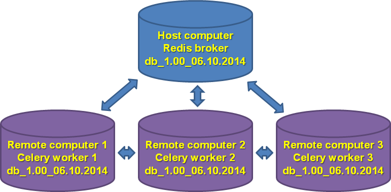

```{r knitsetup, echo=FALSE, results='hide', warning=FALSE, message=FALSE, cache=FALSE}

opts_knit$set(base.dir='./', fig.path='figures/', out.format='md')
opts_chunk$set(cache.path='cache/', fig.path='figures/', cache=FALSE, tidy=TRUE, fig.keep='high', echo=TRUE, dpi=300, out.width=700, prompt=FALSE, comment='##', results='markup', eval=FALSE)
# See yihui.name/knitr/options for more Knitr options.
```

Parallelizing optimizer module
========================================================
The `optimizer` module takes considerable amount of time and computer resources to run. To speed it up, the `optimizer` module uses [Celery distributed task queue](http://www.celeryproject.org/) with [Redis](http://redis.io/) backend.

To gain maximum speedup, it is recommended to set up GenomeRunner and identical [databases](../dbcreator/dbcreator_ucsc.md) on multiple computers within the same network and configure celery workers to interact with Redis broker on the host computer.



Setting up
-----------
The following installation steps assume:
* you have multiple Linux computers within the same network and selected one to be host computer;
* GenomeRunner has been installed in [developer mode](../installation/installation.md);
* The [database](../dbcreator/dbcreator_ucsc.md) and the [background](../dbcreator/dbcreatorBackground.md) have been created and mirrored among the computers.

Check host computer' IP address by running `ifconfig` command.
```
$ ifconfig
eth0      Link encap:Ethernet  HWaddr 76:21:00:f4:56:c2  
          inet addr:10.84.XXX.XXX  Bcast:10.84.XXX.XXX  Mask:255.255.XXX.X
```
Note the inet addr:**10.84.XXX.XXX** number. Add this number in `celeryconfiguration_optimizer.py` file on the host and remote computers:
```
BROKER_URL = "redis://10.84.XXX.XXX:{}/".format(redis_port) + db_num
```

Start redis server on the host computer:
```
nohup redis-server --port 7775 &
```
`nohup` will allow redis to run in the background.

Start the `optimizer` module on the host computer:
```
python -m grsnp.optimizer -g [org] -d [dir] -w 0
```
The **-w 0** argument prohibits the host computer to run workers locally. If sufficient CPU power is avaliable on the host machine, it is OK to set up **-w** argument to "1".

Now, start celery worker on a remote machine:
```
celery worker --app=grsnp.worker_optimizer --data_dir [dir] --loglevel INFO -E -n [workerName] -Q optimizer.group -b redis://10.84.XXX.XXX:7775
```
At that time, this worker start running optimization jobs. Start workers on other remote machines. The workers now will run different optimization jobs and their results will be assembled by the host computer.

Tips
-----
Monitor Celery workers on the host computer via web interface on [http://localhost:5555](http://localhost:5555):
```
celery flower --broker=redis://localhost:7775/
```

Monitor Celery workers on the host computer via command line:
```
celery inspect active --broker redis://localhost:7775/0
celery inspect active_queues -b redis://localhost:7775/0
```

Stop all workers:
```
ps auxww | grep 'celery worker' | awk '{print $2}' | xargs kill -9
```
